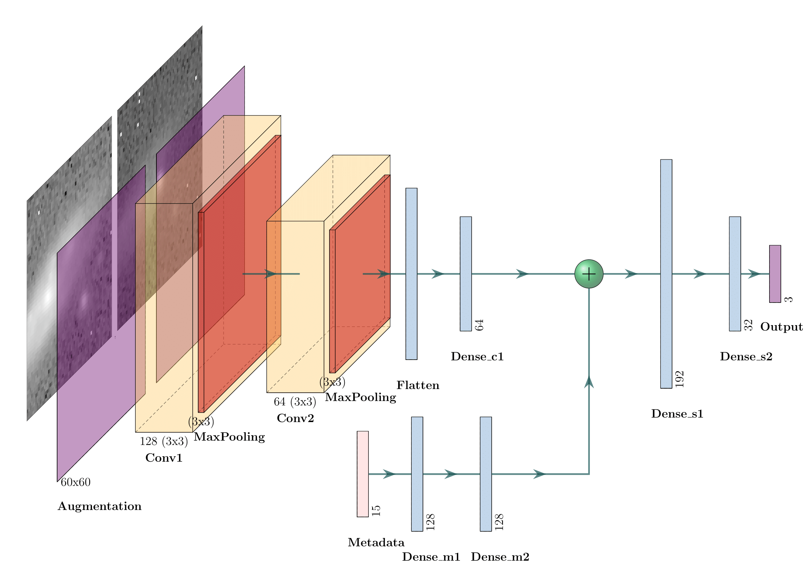

# NEEDLE Classifier

The NEEDLE classifier is a specialized tool designed for identifying rare astronomical transients from real-time alerts, particularly Superluminous Supernovae (SLSNe) and Tidal Disruption Events (TDEs). Developed by Xinyue Sheng and Matt Nicholl, the NEEDLE classifier uses machine learning models to enhance the detection and classification of these rare events.

**Authors**: Xinyue Sheng and Matt Nicholl


## Update V1.1.0

1. Combine g and r band information as metadata. We check the correlation among features and create new features and remove highly correlated ones. Extreme Gradient Boosting algorithm’s feature information gain ranking is applied to the Weighted Feature Layer before fully-connected layers (DNN), in order to give more weights to important features. In this way, the purity of TDE has been rising from 21% to 32%. SLSN rises from 20% to 24%.

2. Record first prediction MJD to the annotation key ‘explanation’ if the object is predicted as SLSN or TDE, if this object has been alerted multiple times, always give the first MJD that predicts as an outlier on the annotation page.

3. For each object, each time prediction, the results are stored in a JSON file.

4. For each object, with and without a host, we use needle-mix and needle-r two versions of models (averaged by 5 models for each version) to give predictions, and weight the results by 6 (mixed) :4 (r). The reason is needle-r has better completeness of SLSN compared with needle-mix, but we could change it later.

5. Apply the discovery date in the forced-photometry if the information is given.

## Key Features
- **Architecture**:  
* This is a demo architecture, might be mended in practice.
- **Open Source**: The dataset is available for re-training the models.
- **Well-trained Models**: Includes 10 models of NEEDLE-TH with associated datasets. 
- **Lasair Version**: Requires an API token, which can be obtained by contacting the Lasair team. A Lasair version of the well-trained model (without dataset) will be released soon.
- **Config.py**: A configuration file for inputting file paths.
- **Makefile**: A Makefile to re-train the model with randomly shuffled test sets.

## Dataset

The dataset is in HDF5 format and is accessible via [this link on Kaggle](https://www.kaggle.com/datasets/sherrysheng97/needle-repo-dataset). Download `data.hdf5` and `hash_table.json` and put them into the folder 'needle_th_models'.
```sh
   kaggle datasets download -d sherrysheng97/needle-repo-dataset
```
## Contact Information

For any questions or comments, you can contact Xinyue Sheng at Xsheng03@qub.ac.uk.

## Getting Started

To begin using the NEEDLE classifier, follow these steps:

1. **Download the Dataset**: Download the HDF5 dataset.
2. **Set Virtual Environment**: Set a conda envrionment, and use `requirements.txt` to download all needed packages.
```sh
   conda create --name needle_env python=3.9
   conda activate needle_env
   pip install -r requirements.txt

```
2. **Set Up Config.py**: Edit the `Config.py` file to include the file paths for your data and models. Note the data for IMAGE_PATH, MAG_PATH, HOST_PATH are not given, please contact the author if desired.
3. **Re-train Models**: If desired, use the provided dataset to re-train the models on your local machine. Simply use Makefile to train 10 new models.
```sh
   Make
```
4. **Request API Token**: For using the Lasair version, request an API token from the Lasair team.


## References

Xinyue Sheng, Matt Nicholl, Ken W Smith, David R Young, Roy D Williams, Heloise F Stevance, Stephen J Smartt, Shubham Srivastav, Thomas Moore, *NEural Engine for Discovering Luminous Events (NEEDLE): identifying rare transient candidates in real time from host galaxy images*, Monthly Notices of the Royal Astronomical Society, Volume 531, Issue 2, June 2024, Pages 2474–2492, [https://doi.org/10.1093/mnras/stae1253](https://doi.org/10.1093/mnras/stae1253)